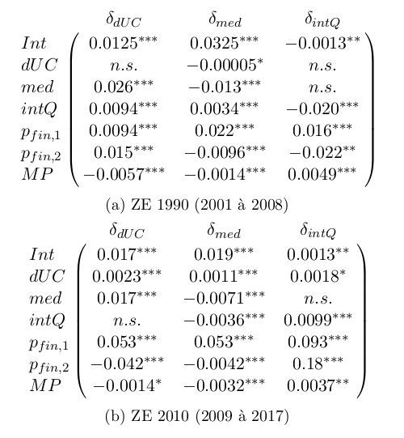

# Analyse dynamique de la polarisation des territoires français

Ayant identifié quel indicateur quantitatif traduit la polarisation des revenus entres territoires, nous allons à présent chercher à en caractériser les dynamiques par la construction d'un modèle de régression. En d'autres termes, nous allons essayer de prédire la valeur de certaines variables (celles traduisant la polarisation ou ses variations) sur la base d'un jeu d'autres variables en estimant la meilleur valeur possible des paramètres dans une relation du type :

où les termes de gauche (celles que notre modèle cherche à prédire) représentent respectivement notre mesure de polarisation des revenus (en haut) et sa croissance annuelle (en bas) ; et celles de droite (celles auxquelles notre modèle fait appel pour sa prédiction) représentent dans l'ordre un "intercept" visant à capturer d'éventuels effets statiques, les variations de deux mesures de la pression financière internationale, celles d'un proxy de la polarisation de la productivité entre les zones d'emploi, et (en bas uniquement) celles de notre mesure de polarisation des revenus. Nous obtenons les résultats suivants, où "n. s." signifie que nous avons échoué à prouver l'existence d'un effet (p>=0.1), "\*" que l'effet mesuré est incertain (0.1>p>=0.01), et "\*\*" ou "\*\*\*" que l'effet mesuré est raisonnablement certains (resp. 0.01>p>=0.001 et 0.001>p) :

Nous ne mesurons donc aucun effet solide de la pression financière internationale sur la polarisation des revenus, mais il semble apparaître que la polarisation de la productivité a un effet antagoniste sur celle des revenus. Ce résultat est, si on l'énonce ainsi, très étonnant : on penserait au contraire que la concentration de la productivité dans certaines zones d'emplois faciliterait la concentration des revenus dans ces mêmes zones d'emploi.

Cependant, nous n'avons trouvé aucune mesure directe de la productivité par zone d'emploi sur la période d'étude, et notre variable de "polarisation de la producitivité" est en fait calculée sur la base de la part de l'emploi tertiaire dans chaque zone d'emploi. Il est donc plus vraisemblable d'interpréter notre résultat en conjecturant que la transition de l'économie dans son ensemble vers le tertiaire ait sous-tendu une polarisation des emplois tertiaires les plus productifs dans les grands centres urbains, et que cette polarisation ait bien eu un effet à la hausse sur celle des revenus.

Nous allons à présent nous tourner vers le niveau plus fin des zones d'emploi pour caractériser plus précisément les dynamiques d'émergence des pôles urbains. Nous avons accès à un éventail de données traduisant différents aspects du processus de métropolisation : densité de population (traduisant le niveau d'intégration au tissu urbain d'un territoire), revenu médian (caractérisant le niveau de revenus associé à l'accès au travail local), quotient interdécile (traduisant la polarisation au sein du territoire), potentiel de marché (traduisant l'accès du territoire à des opportunités d'exportation dans le cadre classique d'un modèle gravitaire, voir par exemple [Combes et al, 2011](../conclusion#combes-et-al-2011)). Nous chercherons à prédire sur la base de ce jeu de variables ainsi que sur les mesures de la pression financière internationale évoquées plus haut la croissance annuelle des trois premières, nous permettant d'établir le tableau suivant. Nous obtenons les résultats suivants :

On y observe tout d'abord que, tout le long de la période d'étude, le potentiel de marché exerce un effet antagoniste sur la croissance du revenu médian, mais favorise au contraire celle du quotient interdécile. De plus, le revenu médian a un effet positif sur la croissance de la densité démographique. Cela traduit probablement un effet d'attraction des populations par les centres urbains (où les revenus sont typiquement plus élevés), ainsi que de captation des flux économiques interrégionaux par la fraction la plus riche des populations. Il existe donc sur toute la période un double effet de polarisation géographique (concentration de l'activité dans les territoires les plus riches) et social (concentration des richesse dans les populations les plus riches).

De plus, le quotient interdécile passe d’une tendance à la baisse, un effet négatif sur sa propre croissance, et un effet positif sur celle du revenu médian jusqu'à 2008, à une situation diamétralement opposée à partir de 2009. Au même moment, l'effet économique de la première mesure de pression financière internationale (la part des capitaux étrangers dans la dette d'État) s'intensifie, alors que la deuxième (la part des capitaux étrangers dans les actions du CAC 40) acquiert un fort effet sur la croissance du quotient interdécile. La crise financière de 2008 semble donc avoir renforcé les effets de captation économique par les plus riches, notamment en renforçant l'emprise de la sphère financière sur l'économie réelle.
