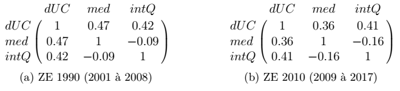
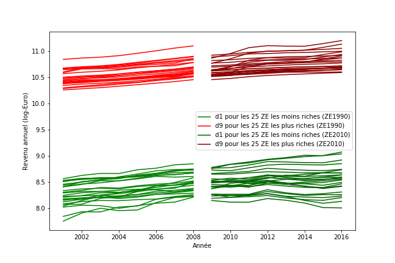
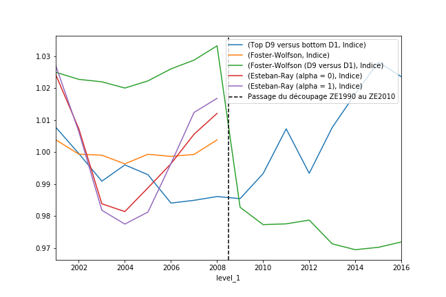

# Analyse de la notion de "polarisation des revenus" dans son application à la France contemporaine

Nous allons à présent nous intéresser à l'évolution sur notre période d'étude de différentes grandeurs de polarisation à l'échelle des territoires français. La polarisation est un concept polysémique pouvant aussi bien traduire la mesure économétrique de la concentration des revenus que les effets géographiques d'aggrégation de l'activité économique. Classiquement, la notion de polarisation renvoie en économie aux indicateurs de Foster-Wolfson ou d'Esteban-Ray, renvoyant tous deux à une mesure de l'écart de la distribution des revenus à une distribution idéale - centré sur la médiane pour le premier, homogène selon la catégorie sociale pour le second - comme décrit dans [Échevin & Parent, 2002](../conclusion#echevin-parent-2002) Ces mesures, parce qu'elles contiennent une information relative à la structure de la distribution des revenus et non seulement sur son écart, sont qualitativement différentes des mesures classiques d'inégalité comme le Gini ou le quotient interdécile.

L'analyse cartographique que nous avons menée précédemment renvoie par contre à la caractérisation de la polarisation comme effet géographique de concentration des revenus, laquelle rejoint essentiellemet une mesure d'inégalité territoriale. Comme nous l'avons établi par analyse visuelle, la densité de population corrèle fortement avec le niveau de revenus aussi bien qu'avec le quotient interdécile. Cette relation, que nous avions déjà adressée lors de notre analyse visuelle, est la trace d'une forme de polarisation au sens géographique.

Afin de caractériser les dynamiques de cette polarisation, nous avons décidé de représenter graphiquement l'évolution du revenu des plus riches des ZE au revenu médian le plus élevé et de celle des plus pauvres des ZE au revenu médian le moins élevé. Ces courbes montrent l'existence d'une croissance homogène à l'échelle des déciles et des territoires français - sauf pour les ZE où les revenus du travail sont les moins élevés, dont certaines voient la croissance des revenus de leurs plus pauvres décrocher à partir de 2009. Cela confirme d'une attraction des richesses des populations marginales vers les populations centrales économiquement, c'est à dire d'un processus de polarisation au sens géographique.

Si l'on trace l'évolution de différentes mesures de polarisation, on s'apercevra toutefois que les indices classiques de Foster-Wolfson et d'Esteban-Ray ne traduisent en aucun cas ce décrochage du revenu des populations marginales. Au contraire, la mesure dérivée de Foster-Wolfson que nous avons pu définir sur la période d'étude complète (laquelle corrèle bien aux autres mesures de polarisation que nous n'avons pu définir que sur 2001-2008) s'effondrent alors même que l'écart des revenus entre populations centrales et marginales augmentent mesurablement. Ce résultat établit l'inaptitude des notions économiques classiques de polarisation à rendre compte du phénomène de "métropolarisation".

Pour poursuivre notre analyse dynamique de la polarisation en France, nous recruterons donc l'écart logarithmique des revenus entre populations centrales et marginales, plutôt que les mesures de polarisation classiques.
